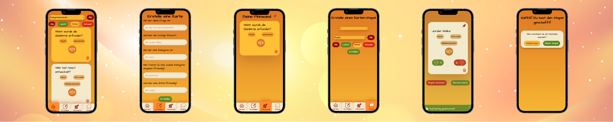

# Capstone Projekt: Cardify 📚

## Für das Web Development Bootcamp bei [neuefische GmbH](https://www.neuefische.de/weiterbildung/web-development)

Do you want the english version? Click [here](#englishVersion).

### Karteikarten sind soooooo 90er!!??

Richtig? Falsch! Cardify holt die guten alten Karteikarten ins 21. Jahrhundert! Und das beste? Je nachdem wie oft du die Fragen richtig oder falsch beantwortet hast werden Schwierigkeitsgrade festgelegt. So kannst du jeden Tag neu entscheiden, ob du eine Herausforderung suchst 💪 oder ob du lieber entspannt wiederholen willst, was du schon gut kannst 🧘

 

## Demo:

Erstelle dir gleich deine ersten Karten in der Demo auf Vercel: [Das will ich ausprobieren!](https://capstone-project-cardify.vercel.app/)

**Wichtig:** Diese Demo ist für Smartphones optimiert.

 

## Tech Stack

- [React](https://reactjs.org/)
  - [React Router](https://reactrouter.com/)
  - [React Testing Library](https://testing-library.com/docs/react-testing-library/intro/)
  - [Jest](https://jestjs.io/)
  - [React Custom Hooks](https://reactjs.org/docs/hooks-custom.html)
  - [React Toastify](https://fkhadra.github.io/react-toastify/introduction)
  - [React CardFlip](https://www.npmjs.com/package/react-card-flip)
- [JavaScript](https://developer.mozilla.org/en-US/docs/Web/JavaScript)
- [styled components](https://styled-components.com/)
- [Storybook](https://storybook.js.org/)
- [local storage](https://developer.mozilla.org/en-US/docs/Web/API/Window/localStorage)

 

## Projekt Setup

- Klone dieses Repository
- Installiere alle dependencies mit `$ npm install`
- Führe die App mit `$ npm run dev` im Developer Modus aus
- Server: [http://localhost:3000/](http://localhost:3000/)
- Führe die Tests mit `$ npm run test` aus
- Wenn du Storybook nutzen willst führe `$ npm run storybook` aus

---

 

<h1 id="englishVersion"> Capstone Project: Cardify 📚 </h1>

## For Web Development Bootcamp at [neuefische GmbH](https://www.neuefische.de/weiterbildung/web-development)

 

### Flashcards are soooooo 90s!!?

Right? Wrong! Cardify brings the good old index cards into the 21st century! And the best part? Depending on how many times you answered the questions right or wrong, difficulty levels are set. So you can decide every day if you want a challenge 💪 or if you prefer to relax and repeat what you already know well 🧘

 

## Demo:

Create your first cards right now in the demo on Vercel: [I want to try this out!](https://capstone-project-cardify.vercel.app/)

**Important:** This demo is optimized for mobile screen.

 

## Tech Stack

- [React](https://reactjs.org/)

  - [React Router](https://reactrouter.com/)
  - [React Testing Library](https://testing-library.com/docs/react-testing-library/intro/)
  - [Jest](https://jestjs.io/)
  - [React Custom Hooks](https://reactjs.org/docs/hooks-custom.html)

- [JavaScript](https://developer.mozilla.org/en-US/docs/Web/JavaScript)
- [styled components](https://styled-components.com/)
- [Storybook](https://storybook.js.org/)
- [local storage](https://developer.mozilla.org/en-US/docs/Web/API/Window/localStorage)

 

## Project Setup

- Clone this repository
- You don't need an API key
- Install all dependencies with `$ npm install`
- Run app in dev mode with `$ npm run dev`
- Server: [http://localhost:3000/](http://localhost:3000/)
- Run tests via `$ npm run test`
- Run Storybook with `$ npm run storybook`
